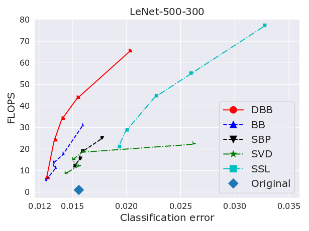
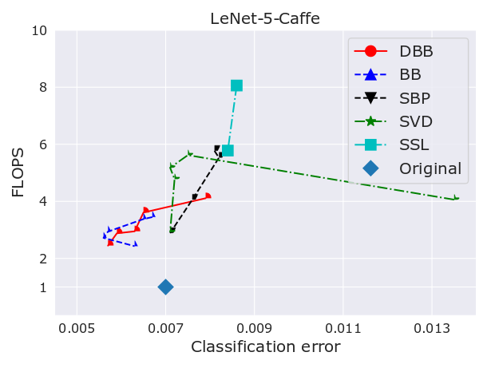
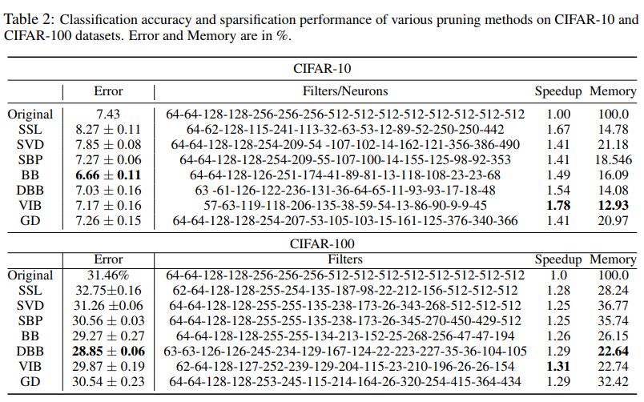

# A Library for Variational Dropouts

### **CONTENT**
> A Library for Variational Dropouts including Generalized Dropout, Concrete Dropout,
> Beta-Bernoullid Dropout, etc.

+ Juho Lee (AITRICS), Saehoon Kim (AITRICS), Jaehoon Yoon (KAIST), Haebeom Lee (KAIST), Eunho Yang (KAIST), Sung Ju Hwang (KAIST)

<b> Update (December 12, 2018)</b> TensorFlow implementation of
[Adaptive Network Sparsification via Dependent Variational Beta-Benoulli Dropout]
(https://arxiv.org/abs/1805.10896)

## Abstract

While variational dropout approaches have been shown to be effective for network
sparsification, they are still suboptimal in the sense that they set the dropout rate for
each neuron without consideration of the input data. With such input-independent
dropout, each neuron is evolved to be generic across inputs, which makes it difficult
to sparsify networks without accuracy loss. To overcome this limitation, we propose
adaptive variational dropout whose probabilities are drawn from sparsity-inducing
beta-Bernoulli prior. It allows each neuron to be evolved either to be generic or
specific for certain inputs, or dropped altogether. Such input-adaptive sparsityinducing
dropout allows the resulting network to tolerate larger degree of sparsity
without losing its expressive power by removing redundancies among features.
We validate our dependent variational beta-Bernoulli dropout on multiple public
datasets, on which it obtains significantly more compact networks than baseline
methods, with consistent accuracy improvements over the base networks.

## Prerequsites
Python 2.7, Tensorflow >= 1.10

## Getting Started

Step 1. Download MNIST, CIFAR-10, CIFAR-100 <br />
Step 2. Edit src/utils/paths.py <br />

```bash
$ cd /src/experiments
$ python run.py --net lenet_fc --mode base
$ python run.py --net lenet_fc --mode bbd
```

### Results
<p float="left">
  
  
</p>



# XAI Project

### **Project Name**
> A machine learning and statistical inference framework for explainable artificial intelligence(의사결정 이유를 설명할 수 있는 인간 수준의 학습·추론 프레임워크 개발)
### **Managed by**
> Ministry of Science and ICT/XAIC
### **Participated Affiliation**
> UNIST, Korean Univ., Yonsei Univ., KAIST., AITRICS
### **Web Site**
> <http://openXai.org>
